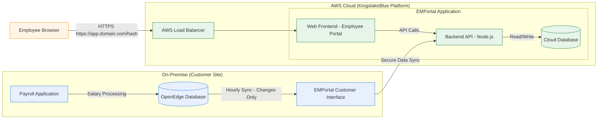

```mermaid
flowchart LR
    %% ======================
    %% ON-PREMISE
    %% ======================
    subgraph ONPREM["On-Premise (Customer Site)"]
        direction TB
        A[Payroll Application]
        B[(OpenEdge Database)]
        C[EMPortal Customer Interface]
        
        A -->|Salary Processing| B
        B -->|Hourly Sync - Changes Only| C
    end

    %% ======================
    %% CLOUD
    %% ======================
    subgraph CLOUD["AWS Cloud (KingslakeBlue Platform)"]
        direction TB
        
        G[AWS Load Balancer]
        
        subgraph APP["EMPortal Application"]
            F[Web Frontend - Employee Portal]
            D[Backend API - Node.js]
            E[(Cloud Database)]
        end
        
        G --> F
        F -->|API Calls| D
        D -->|Read/Write| E
    end

    %% ======================
    %% DATA FLOW
    %% ======================
    C -->|Secure Data Sync| D

    %% ======================
    %% USER ACCESS
    %% ======================
    U[Employee Browser]
    U -->|HTTPS https://app.domain.com/hash| G

    %% ======================
    %% STYLING
    %% ======================
    classDef onprem fill:#E8F0FE,stroke:#1A73E8,stroke-width:1px;
    classDef cloud fill:#E6F4EA,stroke:#188038,stroke-width:1px;
    classDef user fill:#FFF4E5,stroke:#FB8C00,stroke-width:1px;

    class A,B,C onprem;
    class D,E,F,G cloud;
    class U user;
```